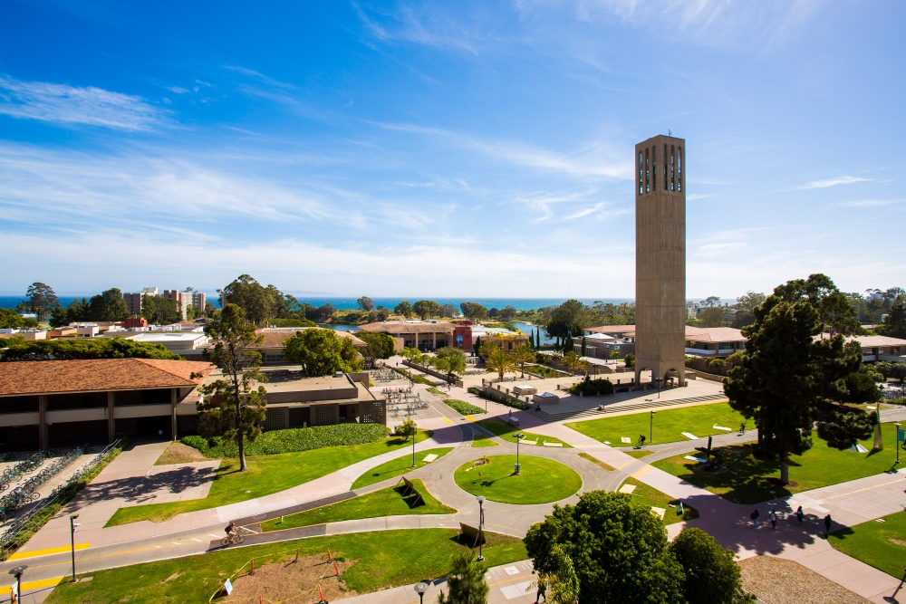

# **Hello! My name is Giselle Orozco :)**

If you are reading this right now then you have stumbled onto my page so welcome! Feel free to look around! My name is Giselle and I am a 4th year student at UC Santa Barbara. I am from the San Fernando Valley, but moved to SB to pursue higher education. I am a Geography major with an emphasis in GIS. I decided to change my major my 3rd year because I was interested in what the department had to offer. My goal is to take what I have learned over the years and give back to my hometown both environmentally and economically and so I hope to add future projects onto this web page. On my free time I enjoy listening to music and spending time with my friends and family oh and my dog Panda! I hope you enjoy your stay here and hope you have a great day!
---
